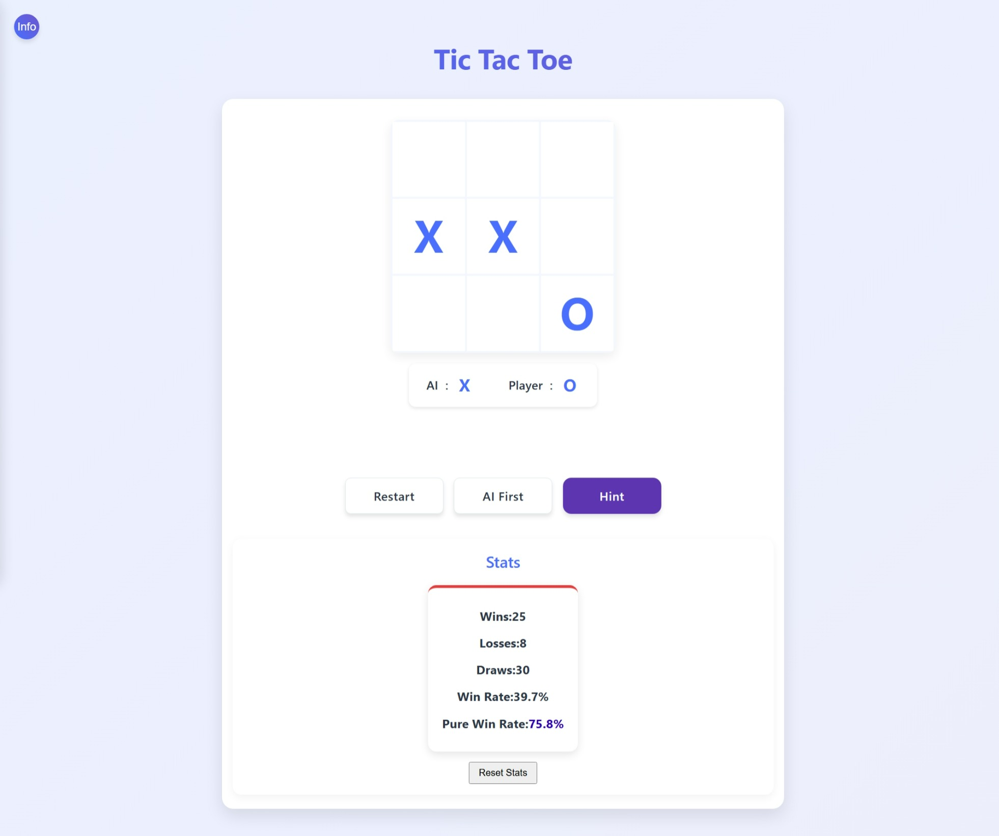

# Tic Tac Toe mit Monte-Carlo-Baumsuche

[English](README.md) | [中文](README.zh-CN.md) | [日本語](README.ja.md) | [한국어](README.ko.md) | [Русский](README.ru.md) | [Français](README.fr.md) | [Español](README.es.md) | [Deutsch](#deutsch)

*Hinweis: Wenn preview.de.jpeg existiert, wird es stattdessen angezeigt*

## Online-Spiel

Du kannst das Spiel online spielen unter: [https://ian-miller.github.io/tic-tac-toe/](https://ian-miller.github.io/tic-tac-toe/)

## Projektvorstellung

Dies ist ein Tic Tac Toe-Spiel, das mit dem Monte-Carlo-Baumsuche-Algorithmus (MCTS) implementiert wurde.

Dieses Projekt ist meine praktische Arbeit beim Erlernen des Monte-Carlo-Baumsuche-Algorithmus. MCTS ist ein heuristischer Suchalgorithmus für Entscheidungsprozesse, der besonders für die KI-Implementierung in Brettspielen geeignet ist.

## Algorithmen

### Monte-Carlo-Baumsuche
Die Monte-Carlo-Baumsuche ist ein probabilistischer Algorithmus, der durch zufällige Simulationen die Gewinnwahrscheinlichkeit jedes Zuges bewertet.

In diesem Tic Tac Toe-Spiel nutzt der KI-Gegner den MCTS-Algorithmus, um den besten Zug durch die folgenden Schritte zu bestimmen:
1. Selektion: Beginnend beim Wurzelknoten wird der vielversprechendste Kindknoten mit der UCB-Formel ausgewählt
2. Expansion: Wenn ein nicht vollständig expandierter Knoten erreicht wird, werden neue Kindknoten erstellt
3. Simulation: Das Spiel wird vom neuen Knoten aus zufällig bis zum Ende simuliert
4. Rückpropagierung: Die Ergebnisse werden an alle besuchten Knoten zurückgegeben

### Minimax-Algorithmus
Der Minimax-Algorithmus ist ein deterministischer Algorithmus, der rekursiv alle möglichen Spielzustände bewertet, um die optimale Lösung zu finden.

Der Algorithmus enthält auch Optimierungsstrategien wie die Anpassung des Temperaturparameters und die Erkennung dringender Züge. 