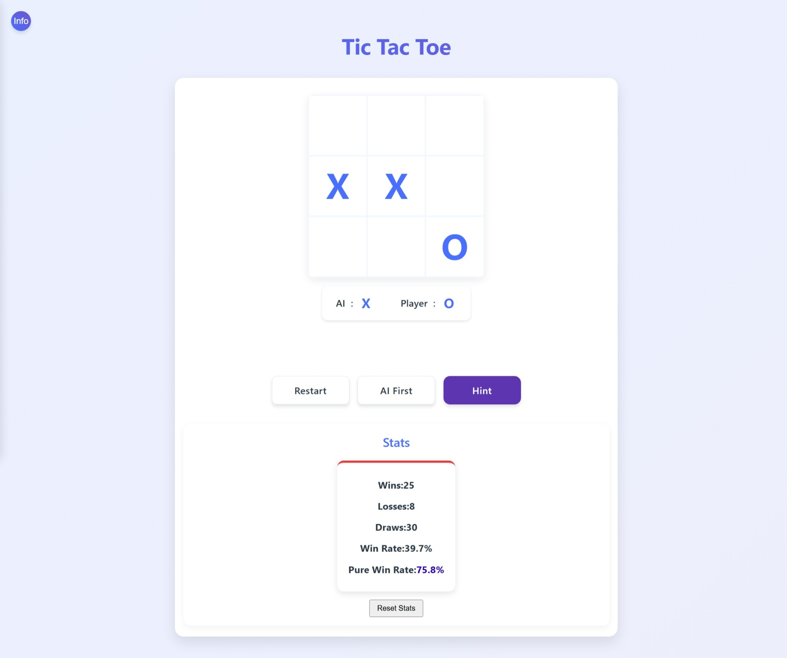

# Tic-Tac-Toe avec recherche arborescente Monte-Carlo

[中文](README.zh-CN.md) | [English](README.md) | [日本語](README.ja.md) | [한국어](README.ko.md) | [Русский](README.ru.md) | [Français](#français)

*Note : Si preview.fr.jpeg existe, il sera affiché à la place*

## Jeu en ligne

Vous pouvez jouer au jeu en ligne ici : [https://ian-miller.github.io/tic-tac-toe/](https://ian-miller.github.io/tic-tac-toe/)

## Présentation du projet

Ceci est un jeu de Tic-Tac-Toe implémenté à l'aide de l'algorithme de recherche arborescente Monte-Carlo (MCTS).

Ce projet est mon travail pratique lors de l'apprentissage de l'algorithme de recherche arborescente Monte-Carlo. MCTS est un algorithme de recherche heuristique utilisé pour les processus de décision, particulièrement adapté à l'implémentation d'IA dans les jeux de plateau.

Dans ce jeu de Tic-Tac-Toe, l'adversaire IA utilise l'algorithme MCTS pour déterminer le meilleur coup à travers les étapes suivantes :
1. Sélection : En partant du nœud racine, sélectionner le nœud enfant le plus prometteur en utilisant la formule UCB
2. Expansion : Si un nœud non complètement développé est atteint, créer de nouveaux nœuds enfants
3. Simulation : Simuler aléatoirement le jeu jusqu'à sa conclusion à partir du nouveau nœud
4. Rétropropagation : Mettre à jour les résultats pour tous les nœuds visités

L'algorithme comprend également des stratégies d'optimisation telles que l'ajustement des paramètres de température et la reconnaissance des coups urgents. 